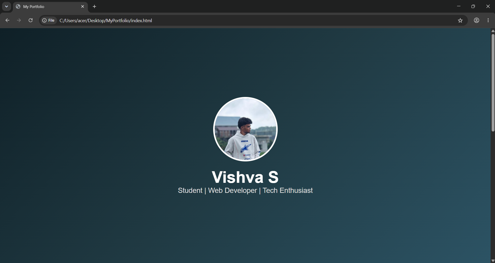

# Ex01 Portfolio
## Date:28.07.26

## AIM
To create a Portfolio using HTML and CSS.

## ALGORITHM
### STEP 1
Create an HTML file (index.html)

### STEP 2
Create a CSS file (style.css)

### STEP 3
Include a navigation bar with links to different sections.

### STEP 4
Add structured sections for introduction, about, projects, and contact details.

### STEP 5
Define global styles for fonts, colors, and layout.

### STEP 6
Style the header, navigation bar, and sections.

### STEP 7
Use Flexbox or CSS Grid for layout design.

### STEP 8
Add hover effects and transitions for interactivity.

### STEP 9
Add Images and Media.

### STEP 10
Use optimized images for a professional look.

### STEP 11
Open the HTML file in a browser to check layout and functionality.

### STEP 12
Fix styling issues and refine content placement.

### STEP 13
Deploy the Portfolio.

### STEP 14
Upload to GitHub Pages for free hosting.

## PROGRAM
```
<!DOCTYPE html>
<html lang="en">
<head>
    <meta charset="UTF-8">
    <meta name="viewport" content="width=device-width, initial-scale=1.0">
    <title>My Portfolio</title>
    <link rel="stylesheet" href="style.css">
</head>
<body>

<header>
    
    <h1>Vishva S</h1>
    <p>Student | Web Developer | Tech Enthusiast</p>
</header>

<section>
    <h2>About Me</h2>
    <p>
        Hi! I'm Vishva. I enjoy web development, technology, cars,
        photography, and learning new skills.
    </p>
</section>

<section>
    <h2>Skills</h2>
    <div class="skills">
        <span>HTML</span>
        <span>CSS</span>
        <span>JavaScript</span>
        <span>Python</span>
    </div>
</section>

<section>
    <h2>Projects</h2>

    <div class="card">
        <h3>Portfolio Website</h3>
        <p>A responsive personal portfolio website.</p>
    </div>

    <div class="card">
        <h3>Car Accessories Website</h3>
        <p>Designed a modern UI for a car accessories shop.</p>
    </div>
</section>

<footer>
    <h2>Contact</h2>
    <p>Email:vishvasivakumar1071@gmail.com</p>
    <p>phone no:7539977542</p>

</footer>

</body>
</html>
css

*{
    margin:0;
    padding:0;
    box-sizing:border-box;
    font-family:Arial,sans-serif;
}

body{
    background:#111;
    color:white;
}

header{
    height:100vh;
    display:flex;
    flex-direction:column;
    justify-content:center;
    align-items:center;
    background:linear-gradient(135deg,#0f2027,#203a43,#2c5364);
}

.profile{
    width:200px;
    height:200px;
    border-radius:50%;
    border:5px solid white;
    object-fit:cover;
    margin-bottom:20px;
}

h1{
    font-size:50px;
}

header p{
    font-size:22px;
    color:#ddd;
}

section{
    padding:60px 10%;
}

h2{
    margin-bottom:20px;
    color:#00e5ff;
}

.skills span{
    display:inline-block;
    background:#00e5ff;
    color:black;
    padding:10px 20px;
    border-radius:30px;
    margin:10px;
    font-weight:bold;
}

.card{
    background:#222;
    padding:20px;
    margin:20px 0;
    border-radius:15px;
    transition:.3s;
}

.card:hover{
    transform:translateY(-10px);
    background:#333;
}

footer{
    text-align:center;
    padding:40px;
    background:#000;
}
```
## OUTPUT



## RESULT
The program for creating Portfolio using HTML and CSS is executed successfully.
